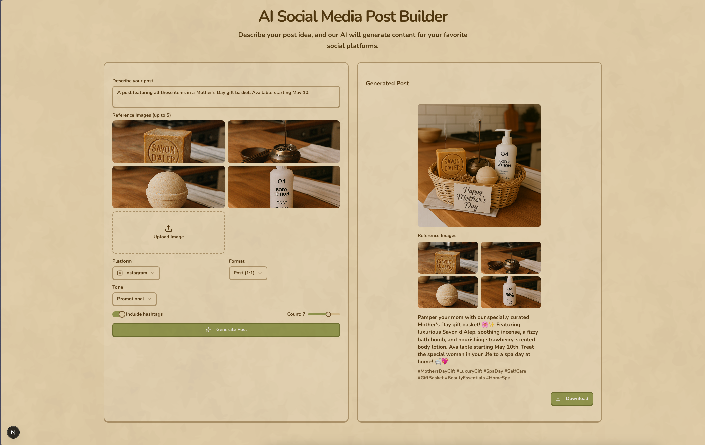

# 🚀 AI Post Builder

## 📸 Screenshots

<div align="center">
  
  
</div>

## ✨ Features

- 🎨 Modern and intuitive interface
- 🤖 AI-powered post generation
- 📱 Responsive design
- ⚡ Optimized performance
- 🔒 Security first approach

## 🛠️ Technologies

- **Framework:** Next.js 13.5.4
- **Language:** TypeScript 5.2.2
- **Styling:** Tailwind CSS 3.3.5
- **Theme:** [Matsu Theme](https://matsu-theme.vercel.app/)
- **State Management:** React Context
- **Forms:** React Hook Form
- **Validation:** Zod
- **UI Components:** Shadcn/ui

## 🚀 Getting Started

1. Clone the repository:

```bash
git clone https://github.com/typper-io/ai-post-builder.git
```

2. Install dependencies:

```bash
pnpm install
```

3. Start the development server:

```bash
pnpm dev
```

4. Open [http://localhost:3000](http://localhost:3000)

## 📦 Available Scripts

- `pnpm dev` - Start development server
- `pnpm build` - Create production build
- `pnpm start` - Start production server
- `pnpm lint` - Run linter
- `pnpm format` - Format code

## 🤝 Contributing

Contributions are always welcome! Feel free to open issues or submit pull requests.

## 📄 License

This project is licensed under the MIT License. See the [LICENSE](LICENSE) file for details.

---

<div align="center">
  <p>Built with ❤️ by <a href="https://github.com/typper-io">Typper</a></p>
</div>
